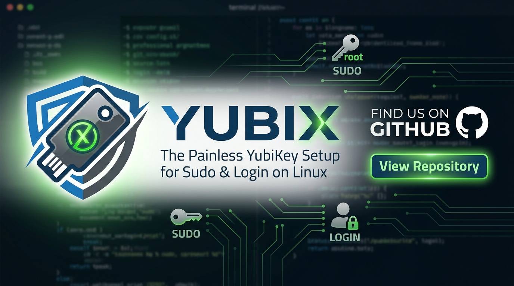

<p align="center">
  
</p>

# Yubix

**Use your YubiKey (or any FIDO2 security key) for login and sudo on CachyOS — safely, with zero terminal work.**

Setting up a security key for Linux login normally means hand-editing PAM files where a single typo locks you out of your own machine. Yubix replaces all of that with a dark, native desktop app and an obsessive safety net.

> ⚠️ **Status: early development.** The core pipeline (enroll → live self-test → transactional apply → countdown auto-revert → boot failsafe) is implemented and under active testing. Not yet packaged for general use.

## What it does

- **Enroll keys by touch** — no `pamu2fcfg`, no config files. Two touches: one to enroll, one on a live verification test.
- **Pick where the key works** — sudo & admin prompts, the Plasma lock screen, the login screen. Each with *touch instead of password* or *password + touch (2FA)*.
- **Never lock you out**:
  - Enrollment is verified against a **throwaway PAM service** before anything real changes.
  - Applying starts a **countdown** — no confirmation, and everything auto-reverts.
  - A **boot failsafe** reverts unconfirmed changes before the login screen even starts if the machine reboots mid-change.
  - **TTY login (Ctrl+Alt+F3) is never modified** — your password always works there.
  - Every change is backed up; `yubix-restore` (plain POSIX sh) can undo everything from an emergency shell.

## Architecture

| Component | What it is |
|---|---|
| `yubix` | Avalonia UI (.NET 10) desktop app — dark graphite + CachyOS teal |
| `yubix-helper` | Root D-Bus service (`io.github.codingncaffeine.yubix`), polkit-authorized; owns all `/etc` writes, enrollment, PAM self-tests, backups, and the revert deadline |
| `Yubix.Core` | Shared PAM generator/transaction engine (fully unit-tested) |
| `yubix-restore` | Dependency-free shell script that replays backup manifests |

PAM strategy: vendor files in `/usr/lib/pam.d/` are shadowed with override files in `/etc/pam.d/` (revert = delete); `/etc/pam.d/sudo` gets a single marker-tagged line (the same idiom CachyOS's `chwd` uses). `system-auth` is never touched. Full details in [docs/PLAN.md](docs/PLAN.md).

## Demo vs. the real thing

Yubix is **one app with two modes** — the demo is not a separate program.
Setting the `YUBIX_ROOT` environment variable re-roots every path Yubix
touches into a sandbox directory, moves the helper onto the **session** D-Bus
bus, and skips polkit. Same UI, same helper, same PAM engine; the only
difference is which `/etc` they're pointed at. If a security key is plugged
in, the demo enrolls and live-verifies against your **real key through real
PAM** (via `pam_wrapper`) — only the file changes land in the sandbox.

| | Demo (fake root) | Real |
|---|---|---|
| PAM files written | `~/yubix-fakeroot/etc/pam.d/…` | `/etc/pam.d/…` |
| Helper runs on | session bus, as your user | system bus, as root |
| polkit authentication | skipped | required for every change |
| Security key | real key if present, simulated otherwise | real key |
| Can it affect your login? | never | yes — guarded by countdown + boot failsafe |

### Run the demo (nothing real is changed)

```sh
sudo pacman -S --needed dotnet-sdk pam-u2f libfido2 pam_wrapper
git clone https://github.com/codingncaffeine/yubix
cd yubix
scripts/yubix-demo
```

The script builds if needed, creates a **fresh sandbox** at `~/yubix-fakeroot`
with copies of your real PAM files, starts the helper on the session bus, and
launches the GUI against it (the helper is cleaned up when you close the
window). Want a launcher? Point a `.desktop` entry's `Exec=` at
`scripts/yubix-demo`.

Manual equivalent, if you'd rather drive it yourself:

```sh
export YUBIX_ROOT=$HOME/yubix-fakeroot
mkdir -p $YUBIX_ROOT/etc/pam.d $YUBIX_ROOT/usr/lib/pam.d $YUBIX_ROOT/var/lib/yubix
cp /etc/pam.d/sudo $YUBIX_ROOT/etc/pam.d/
cp /usr/lib/pam.d/{polkit-1,kde,plasmalogin} $YUBIX_ROOT/usr/lib/pam.d/
dotnet run --project src/Yubix.Helper &   # helper on the session bus
dotnet run --project src/Yubix.App        # the app, talking to it
```

### Run it for real

Real mode has no special flag — it's simply what happens when `YUBIX_ROOT` is
**not** set. But it only works installed, because the helper must run as root
on the system bus, and that requires the D-Bus service/policy files, the
polkit action, and the boot-failsafe unit to be in place:

```sh
cd packaging
makepkg -si        # builds the package and installs it with its system files
```

Then launch **Yubix** from the application menu. The helper is D-Bus-activated
on demand; read-only status needs no authentication, and any actual change
prompts through polkit. (Per the status note above: this path is the newest —
demo mode is the recommended way to explore while v1 stabilizes.)

Tests: `dotnet test`

## License

[GPL-3.0-or-later](LICENSE).
